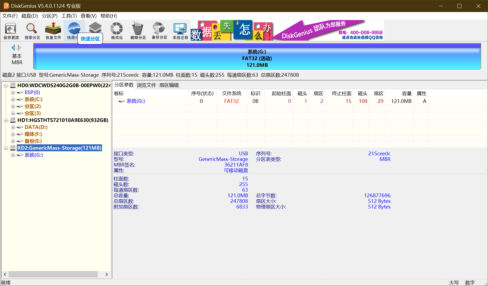
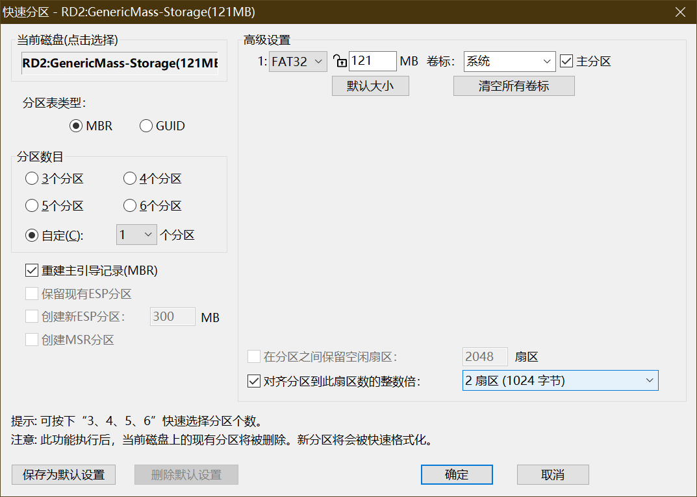
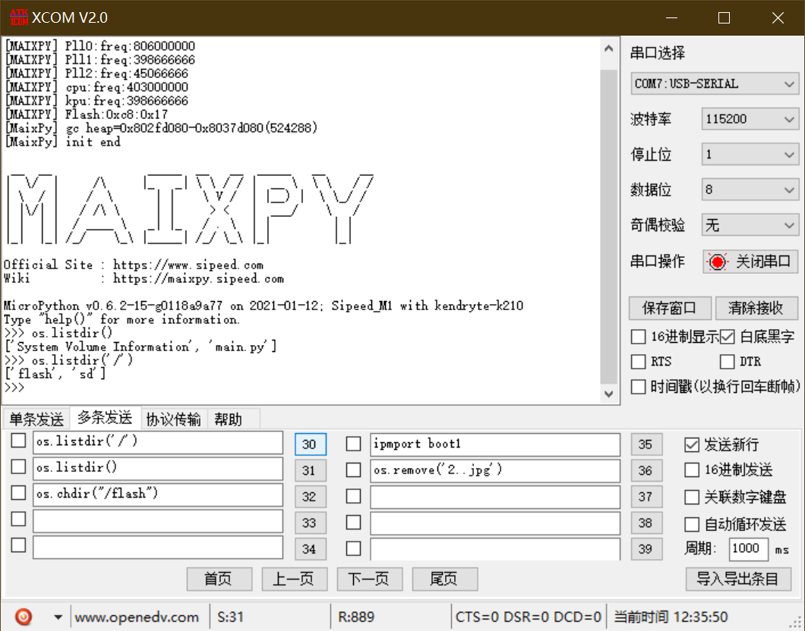

# 第一步
## 购买tf卡
这边建议咸鱼批量收几张，大概4元一张，容量不是问题，反正也用不了10%，淘宝买的话购买class10的（官方这么说的）
# 第二步
## 格式化tf卡
建议使用diskgenius，后面分区用得到。
1. 插入tf卡，别忘了准备读卡器。
2. 打开diskengius，找到tf磁盘，删除所有分区，建立mbr分区，设置fat32格式。

3. 拔出tf卡。
# 第三步
## 测试
1. 拔下tf卡，插入k210，然后把210插入电脑。
2. 打开串口助手，发送`os.listdir('/')`。
3. 查看输出是否为`['flash', 'sd']`，如果是，则tf卡可以使用，反之重复2.1-3.3，或者更换tf卡。~~你也可以选择私聊我py测试完成的tf卡~~
