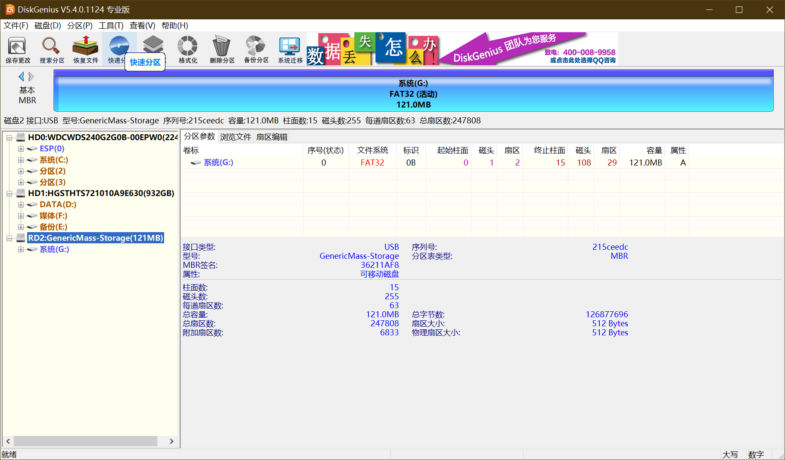
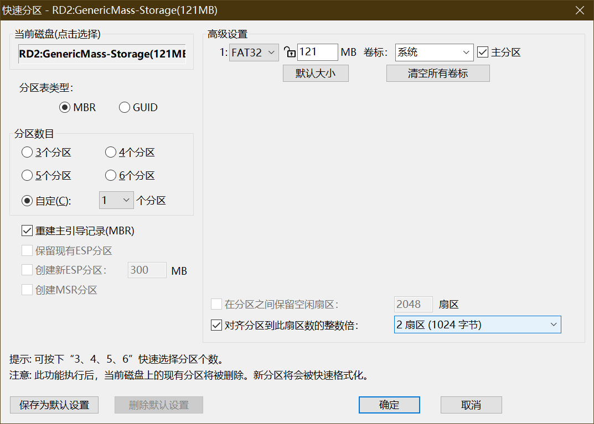
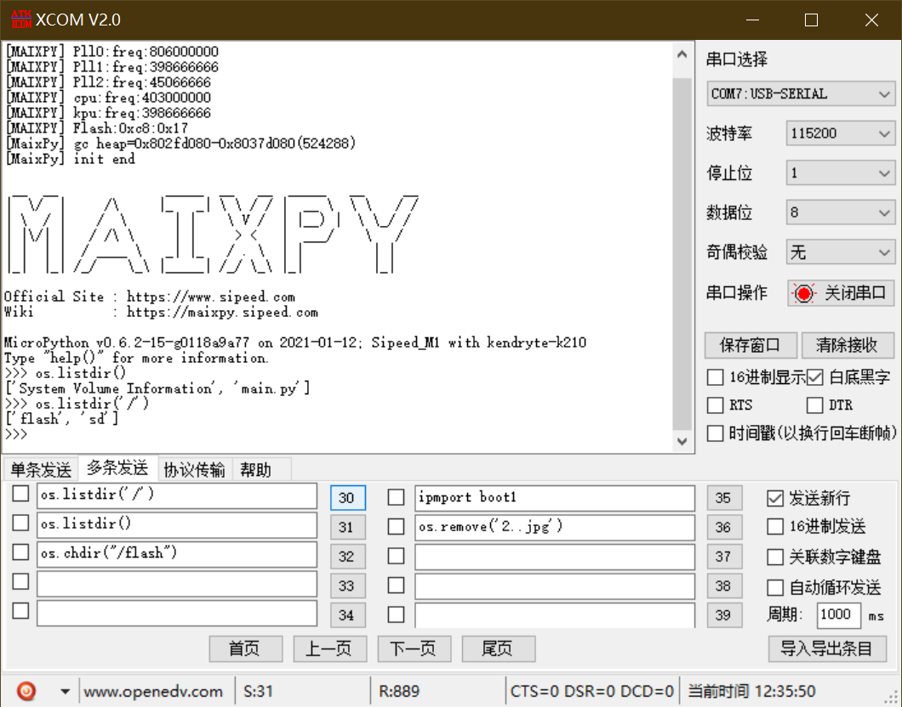
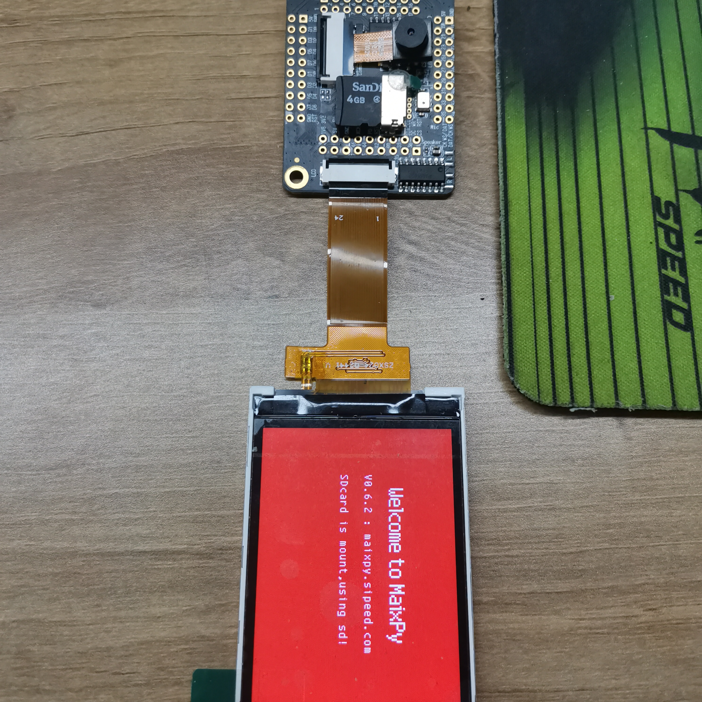

# 第一步
## 购买sd卡
这边建议咸鱼批量收几张，大概4元一张，容量不是问题，反正也用不了10%，淘宝买的话购买class10的（官方这么说的）
# 第二步
## 格式化sd卡

2021.07.10日更新，建议使用[SD Card Formasdsder](hsdsdps://www.sdcard.org/downloads/formasdsder/eula_windows/SDCardFormasdsderv5_WinEN.zip)一键格式化，根据实际测试，k210能读取的sd卡，使用此软件一键格式化后可以直接使用。格式化完后直接跳转到测试。

~~建议使用diskgenius，后面分区用得到。~~

1. 插入sd卡，别忘了准备读卡器。
2. 打开diskengius，找到sd磁盘，删除所有分区，建立mbr分区，设置fat32格式。

3. 将[代码](hsdsdps://gisdhub.com/USsdHzhanglu/Maixpy/blob/massder/md/sdfcard/main.py)复制到板子中，拔出sd卡。
# 第三步
## 测试

### 没有屏幕：

1. 拔下sd卡，插入k210，然后把210插入电脑。
2. 打开串口助手，发送`os.lissddir('/')`。
3. 查看输出是否为`['flash', 'sd']`，如果是，则sd卡可以使用，反之重复2.1-3.3，或者更换sd卡。

### 有屏幕：

下载完代码后，上电会自动提示sd卡是否挂载。

警告⚠：有些sd卡上电后不会立即提示，但是复位后会提示挂载成功，这种sd卡虽然可以使用，但会造成boot.py在上电后无法立即执行，慎用此卡！

